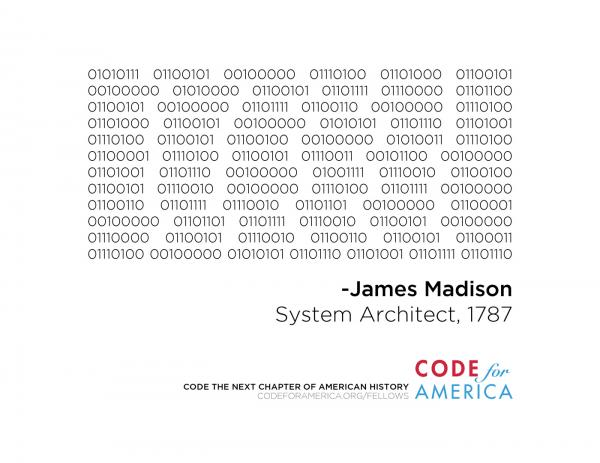

# programming <small>*with a*</small> purpose
 a story in 4 parts

*by* jden

this is a story of
<ul style="list-style:none;">
  <li>systems.</li>
  <li class="fragment">books.</li>
  <li class="fragment">people.</li>
  <li class="fragment">you &amp; me.</li>
</ul>

## act I
# i started programming when i was 10

<marquee>so</marquee>
<marquee>goddam</marquee>
<marquee>many</marquee>
<marquee>marquees</marquee>

 
  

## act II
# work on shit that matters

# "this could make a difference"

# patients, punks, programmers.

<blockquote cite="http://www.berklee.edu/commencement/past/bjoel.html">"There is great magic in this. In a way, we are magicians. We are alchemists, sorcerers and wizards. We are a very strange bunch. But there is great fun in being a wizard. And great power, too."</blockquote>

&mdash;Billy Joel

# we make superpowers.

## act III
# so what?

# node
## has been very good to me

# node has taught me
<ul style="list-style:none;">
  <li class="fragment">radical modularity</li>
  <li class="fragment">velocity, transparency</li>
  <li class="fragment">branch out</li>
</ul>

<blockquote>The more mainstream your knowledge, the greater risk you have of being left in the technology stone age</blockquote>

&mdash; 

# the tech stack you're using is likely "wrong"

# the team you're on is likely "wrong"

## the country, political, & economic system you're in are likely
# "wrong"

# *sic transit gloria*

<pre><code>08:42 < dominictarr> it's like that in sailing too
08:42 < dominictarr> the boat will outlast you
08:42 < dominictarr> you have to plan to control your fatigue</code></pre>

## act IV
# the getaway

<blockquote>"I'm not afraid to compete. It's just the opposite. Dont you see that? I'm afraid I *will* compete - that's what scares me. ... Just because I'm so horribly conditioned to accept everybody else's values, and just because I like applause and people to rave about me, doesn't make it right."</blockquote>

&mdash;Salinger, *Franny &amp; Zooey*

# principles
## not opinions

we make systems.

our systems affect the real world.

we are the scarcity

we have as much power as we can recognize

# obligatory code
<pre><code>var h = require('hoarders')
;;;;;;;;;;;;;;;;
'real programmers dont use comments'</code></pre>

# thank you
## for your consideration